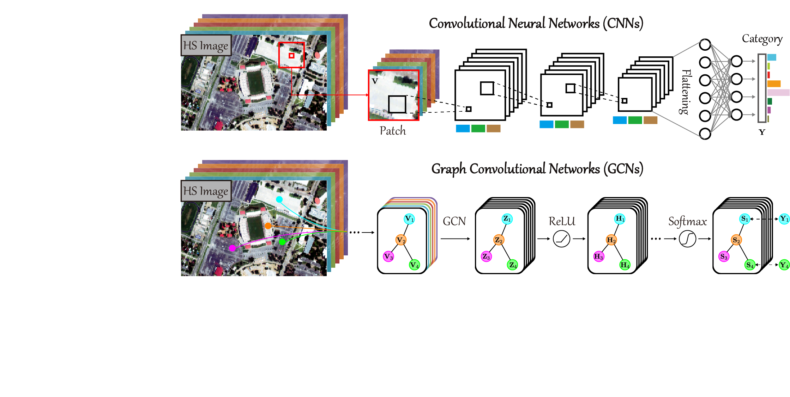

# Graph Convolutional Networks for Hyperspectral Image Classification

[Danfeng Hong](https://sites.google.com/view/danfeng-hong), Lianru Gao, Jing Yao, Bing Zhang, Antonio Plaza, Jocelyn Chanussot
---------------------

The code in this toolbox implements the ["Graph Convolutional Networks for Hyperspectral Image Classification"](https://ieeexplore.ieee.org/document/9170817).
More specifically, it is detailed as follow.

Citation
---------------------

**Please kindly cite the papers if this code is useful and helpful for your research.**

D. Hong, L. Gao, J. Yao, B. Zhang, A. Plaza, J. Chanussot. Graph Convolutional Networks for Hyperspectral Image Classification, IEEE Trans. Geosci. Remote Sens., 2021, 59(7): 5966-5978. 

     @article{hong2021graph,
      title     = {Graph Convolutional Networks for Hyperspectral Image Classification},
      author    = {D. Hong and L. Gao and J. Yao and B. Zhang and A. Plaza and J. Chanussot},
      journal   = {IEEE Trans. Geosci. Remote Sens.}, 
      volume    = {59},
      number    = {7},
      pages     = {5966--5978},
      year      = {2021},
      publisher = {IEEE}
     }

System-specific notes
---------------------
The data were generated by Matlab R2016a or higher versions, and the codes of various networks were tested in Tensorflow 1.14 version (a little bit different from 2.0 version in some functions) in Python 3.7 on Windows 10 machines.

How to use it?
---------------------

Here an example experiment is given by using Indian Pine data. Directly run .py functions with different networks to reproduce the results on the Indian Pine data, which exists in the aforementioned paper. Please note that we fixed the randomness of the parameter initialization to reproduce the unchanged results.

This toolbox consists of eight hyperspectral classification networks as follows

1DCNN: one-dimensional convolutional neural network  
2DCNN: two-dimensional convolutional neural network  
3DCNN：three-dimensional convolutional neural network, which can be found from the paper (Deep Feature Extraction and Classification of Hyperspectral Images Based on Convolutional Neural Networks, Chen et al., TGRS 2016)  
GCN: graph convolutional network  
miniGCN: mini-batch GCN  
FuNet-A: fusion networks with additive fusion  
FuNet-M: fusion networks with element-wise multiplicative fusion  
FuNet-C: fusion networks with concatenation fusion  

If you want to run the code in your own data, you have to 

first of all, use the matlab functions in the folder of DataGenerate_Funciton to prepare the network input data;  
next, change the save route or directly copy the generated data into the folder of HSI_CNN or HSI_GCN;  
finally, run the .py networks.

Moreover, we provide the fucntion of draw_ClassificaitonMap.m to draw the classification maps with the given colormap function, i.e., giveColorCM_HH.m.

If you encounter the bugs while using this code, please do not hesitate to contact us.

:exclamation: The variable in `X_test.mat` was converted to single-precision for efficient use of memory, which may cause slight admissible perturbation on actual results. Due to its large size, you may need to manually download `X_test.mat` to your local in the folder under path `IEEE_TGRS_GCN/HSI_CNN/` by the given the links of google drive or baiduyun as follows

Google drive: https://drive.google.com/file/d/1JonHPynVZWCQ9EvZA-oXiFEPU-giIaYt/view?usp=sharing

Baiduyun: https://pan.baidu.com/s/1XRcKsckcYTqnD_zjOvWHoQ (access code: mrdf)

We also provide the fixed training and testing images for Pavia University, i.e., TRpaviaU.mat and TEpaviaU.mat.

:exclamation: When you use the large-scale data (e.g., testing samples) for generating the graph, if out-of-memory (just in case you do not have a super PC), you can split the testing samples into several groups and handle them separately.

Licensing
---------

Copyright (C) 2020 Danfeng Hong

This program is free software: you can redistribute it and/or modify it under the terms of the GNU General Public License as published by the Free Software Foundation, version 3 of the License.

This program is distributed in the hope that it will be useful, but WITHOUT ANY WARRANTY; without even the implied warranty of MERCHANTABILITY or FITNESS FOR A PARTICULAR PURPOSE. See the GNU General Public License for more details.

You should have received a copy of the GNU General Public License along with this program.

Contact Information:
--------------------

Danfeng Hong: hongdanfeng1989@gmail.com 
Danfeng Hong is with the Univ. Grenoble Alpes, CNRS, Grenoble INP, GIPSA-lab, 38000 Grenoble, France.

